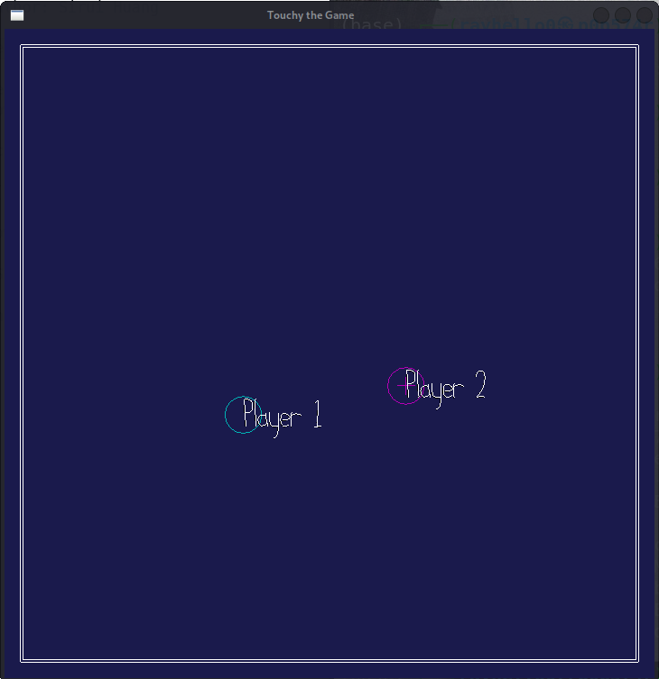

# Touch the Game (This game is unfinished)

Author: Sirui Huang

Design: Try to collide other players into walls to gain points.

Networking: Messages are sent to players regarding their positions, their points, their points, and whether they can now use the dash ability.

Screen Shot:

How To Play:

ASDW to move, space to dash.

This game was built with [NEST](NEST.md).

